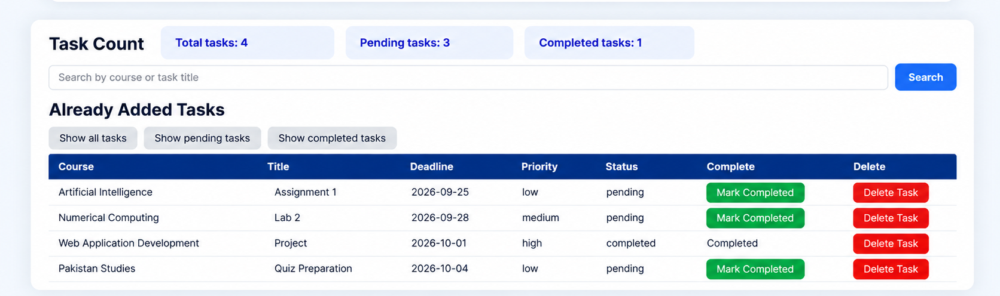
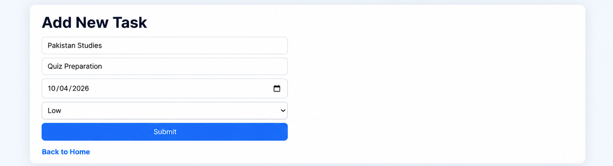

# StudyFlow

StudyFlow is a student task management web application built with Flask, SQLite, HTML, and CSS.

It allows students to organize academic tasks by course, deadline, priority, and completion status while providing search, filtering, and task summary features.

This project was originally built as my final project for **Harvard's CS50's Introduction to Computer Science (CS50x)** and represents the main project from the computer science foundations phase of my CS/AI/ML learning roadmap.

## Demo

Video demonstration:

[Watch the StudyFlow demo on YouTube](https://youtu.be/rcWY2JsWQKE)

### Task Dashboard



### Add a Task



## Features

- Add academic tasks
- Assign each task to a course
- Set task deadlines
- Set low, medium, or high priority
- Store tasks in an SQLite database
- Load previously saved tasks
- Search tasks by course or title
- Filter tasks by:
  - All
  - Pending
  - Completed

- Sort tasks by deadline
- Mark pending tasks as completed
- Delete tasks
- Display:
  - Total task count
  - Pending task count
  - Completed task count

- Validate required task fields

## Task Data

Each task contains the following fields:

- ID
- Course
- Title
- Deadline
- Priority
- Status

Example:

```text
Course: Artificial Intelligence
Title: Complete Assignment 1
Deadline: 2026-10-01
Priority: High
Status: Pending
```

New tasks are automatically assigned:

```text
Status: pending
```

Each task also receives a unique database ID.

## How It Works

StudyFlow provides four main task operations:

```text
1. Add task
2. View and search tasks
3. Mark task as completed
4. Delete task
```

### Add Task

The user enters:

```text
Course
Task title
Deadline
Priority
```

The application validates the submitted data and stores the task in the SQLite database.

### View Tasks

The main dashboard loads tasks from the database and displays them in a table.

Tasks are ordered by:

```text
Deadline
```

The dashboard also displays:

```text
Total tasks
Pending tasks
Completed tasks
```

### Search and Filter

Users can search for tasks by:

```text
Course
Task title
```

Tasks can also be filtered by status:

```text
All
Pending
Completed
```

### Mark Completed

Pending tasks can be marked as completed.

The application updates:

```text
status = pending
```

to:

```text
status = completed
```

for the selected task.

### Delete Task

The user can delete an existing task.

The selected record is removed from the SQLite database using its task ID.

## Project Structure

```text
studyflow/
├── assets/
│   ├── dashboard.png
│   └── add-task.png
├── static/
│   └── styles.css
├── templates/
│   ├── add.html
│   └── index.html
├── README.md
├── app.py
├── schema.sql
├── requirements.txt
└── .gitignore
```

### `app.py`

Contains the Flask application and main routes:

- `/`
- `/add`
- `/mark_completed`
- `/delete_task`

It handles:

- Database queries
- Form submissions
- Input validation
- Searching
- Filtering
- Task statistics
- Task updates
- Task deletion

### `schema.sql`

Defines the SQLite database structure.

The project uses one main table:

```text
tasks
```

### `templates/`

Contains the HTML templates rendered by Flask.

```text
index.html
add.html
```

### `static/styles.css`

Contains the CSS used to style the StudyFlow interface.

### `requirements.txt`

Contains the project dependencies:

```text
flask
cs50
```

## Database

StudyFlow uses SQLite for persistent task storage.

The database schema is:

```sql
CREATE TABLE tasks (
    id INTEGER PRIMARY KEY AUTOINCREMENT,
    course TEXT NOT NULL,
    title TEXT NOT NULL,
    deadline TEXT NOT NULL,
    priority TEXT NOT NULL,
    status TEXT NOT NULL DEFAULT 'pending'
);
```

The local database file is:

```text
studyflow.db
```

It is not included in version control and can be recreated using `schema.sql`.

## Installation

Clone the repository:

```bash
git clone https://github.com/WaleedHassanSh/studyflow.git
```

Move into the project directory:

```bash
cd studyflow
```

Create a virtual environment:

```bash
python3 -m venv .venv
```

Activate it:

```bash
source .venv/bin/activate
```

Install the required dependencies:

```bash
pip install -r requirements.txt
```

Create the SQLite database:

```bash
sqlite3 studyflow.db < schema.sql
```

## Usage

Run the application:

```bash
flask run
```

Then open the local address shown by Flask, typically:

```text
http://127.0.0.1:5000
```

From the dashboard, users can:

```text
Add tasks
Search tasks
Filter tasks
Mark tasks as completed
Delete tasks
```

## Technologies

- Python
- Flask
- SQLite
- SQL
- HTML
- CSS
- Jinja
- CS50 SQL library
- Git
- GitHub

## Design Decisions

### SQLite Storage

SQLite was chosen because it is lightweight, simple to set up, and appropriate for a small database-backed web application.

It allows StudyFlow to persist tasks while demonstrating SQL operations such as:

```text
INSERT
SELECT
UPDATE
DELETE
COUNT
```

### Separate Templates

The dashboard and add-task form use separate HTML templates.

This keeps the application structure clearer and separates different interface responsibilities.

### Separate CSS

Styling is stored in:

```text
static/styles.css
```

instead of being written directly inside the HTML templates.

This keeps presentation separate from page structure.

### Database-Driven Task Status

Task completion status is stored in the database instead of being tracked only in the interface.

This means completion state remains available after the application is restarted.

### POST Requests for Changes

Actions that modify stored data, such as completing or deleting a task, use POST requests.

This keeps data-changing actions separate from normal page retrieval.

## What I Learned

This project helped me practice and reinforce:

- Python
- Flask
- Routing
- HTTP GET and POST requests
- HTML forms
- Input validation
- SQL
- SQLite
- CRUD operations
- Database-backed applications
- Jinja templates
- HTML
- CSS
- Searching and filtering database records
- Connecting frontend, backend, and database components
- Organizing and documenting a small web application

## Limitations

StudyFlow is intentionally a small web application focused on computer science and web application fundamentals.

Current limitations include:

- No user authentication
- No support for multiple users
- No task editing
- No calendar view
- No deadline reminders
- No overdue-task highlighting
- Search and status filtering cannot currently be combined
- No automated test suite
- No production deployment configuration

## Future Improvements

Possible future improvements include:

- Add user authentication
- Support separate task lists for multiple users
- Add task editing
- Highlight overdue tasks
- Add deadline reminders
- Add priority-based sorting
- Combine search and status filtering
- Add a calendar view
- Improve responsive design
- Add automated tests

## Project Context

StudyFlow was originally developed as my final project for **CS50's Introduction to Computer Science**.

It also serves as the main showcase project from **Phase 2 — Computer Science Foundations** of my broader CS/AI/ML learning roadmap.

Roadmap repository:

[View my CS/AI/ML roadmap](https://github.com/WaleedHassanSh/ai-ml-roadmap)

The purpose of this phase was to build foundational knowledge in programming, memory, algorithms, data structures, databases, and basic web applications before progressing into deeper computer science, data analysis, machine learning, deep learning, and modern AI systems.
